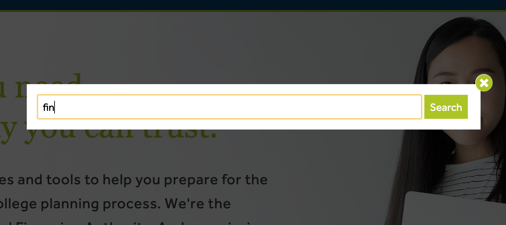
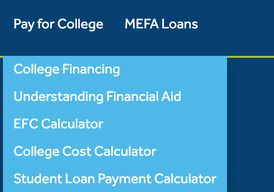

# Government Support for Accessibility to Higher Education Among Underrepresented Groups in Massachusetts
## Assignment 01: Heuristic Evaluation of Massachusetts
### Michael Canabarro | DH 110 | Fall 2021

---

### About the Project 

The highlights of higher education-- lifelong friends, memories, and more-- are often publicized, especially in the digital age, when students' college experiences are often shared on social media platforms. However, behind this glamorous facade, accessibility has been, and still is, one of the greatest issues plaguing higher education. Even in the wake of affirmative action programs over the decades, minority and underrepresented groups still find themselves facing many barriers between them and the esteemed college experience. In this project, I hope to shed light on the issue of accessibility through the lens of user experience in the state of Massachusetts, home to some of the most well-known colleges and universities in the United States. What is the government doing to assist underrepresented groups and make college more accessible to them? Is the government providing information about these programs in a way that makes it easier or more difficult to learn about them? By answering these questions and ones that arise from them, I hope to examine one of many facets in which access to higher education can be improved.

---

### Jakob Nielsen's [10 Usability Heuristics](https://www.nngroup.com/articles/ten-usability-heuristics/) Explained
|Number|Heuristic|Definition|
|---|---|---|
|1|**Visibility of System Status**|The design should always keep users informed about what is going on, through appropriate feedback within a reasonable amount of time.|
|2|**Match Between System and the Real World**|The design should be understandable for its users. It should use words, phrases, and concepts familiar to the user, rather than internal jargon. It should follow real-world conventions and present information in a natural and logical order.|
|3|**User Control and Freedom**| In the case that a user performs an action by mistake, the design should provide a clearly-marked "emergency exit" to quickly abandon the unwanted action. |
|4|**Consistency and Standards**| Words and phrases should have consistent meanings across the entire design, following platform and industry conventions where possible. |
|5|**Error Prevention**| The design should carefully prevent problems from occurring, whether through eliminating conditions that lead to errors or making users confirm their choice before completing an action. |
|6|**Recognition Rather than Recall**| The design should minimize the user's cognitive load by making elements, actions, and options easily visible. The design should be such that users do not have to remember information from other parts of the interface in order to use it. This required information should be visible or easy to locate on the design. |
|7|**Flexibility and Efficiency of Use**| The design should include shortcuts usable for expert users, so that it is equally usable for users of all experience levels. It should also allow users to tailor frequent actions. |
|8|**Aesthetic and Minimalist Design**| The interface should only contain information that is relevant or needed often, as every additional piece of information competes with others for user attention and diminishes others' relative visibility. |
|9|**Help Users Recognize, Diagnose, and Recover from Errors**| Error messages should be easily understandable, precisely indicate the problem, and constructively suggest a solution. |
|10|**Help and Documentation**| If needed, the design must include documentation to guide users in completing certain tasks.

### [Severity Ratings for Usability Problems](https://www.nngroup.com/articles/how-to-rate-the-severity-of-usability-problems/) by Nielsen Norman Group
|Rating|Description|
|---|---|
|1|Cosmetic problem only: need not be fixed unless extra time is available on project|
|2|Minor usability problem: fixing this should be given low priority|
|3|Major usability problem: important to fix, so should be given high priority|

---

## Website 1: [Massachusetts Educational Financing Authority](https://www.mefa.org/)

### About

The Massachusetts Education Financing Authority (MEFA) is a Massachusets state organization that aims to provide help at all stages of school planning, with an emphasis on financial planning. They offer plans for all levels of education, from pre-K to graduate school. In terms of financing, they offer resources to create savings plans, learn more about financial aid, and apply for a loan directly from MEFA. 

In my heuristic evaluation, I will focus on the perspective of a student who needs financial aid in order to go to college and is interested in applying for financial aid. From this point of view, ease of use will be crucial, as it could be the difference between applying for a loan-- and ultimately going to college-- or not.

### Heuristic Evaluation

#### 1. Visibility of System Status

* As words are typed into the search bar, no potential searches appear underneath, no matter how many characters are typed. Without this information, it is difficult to tell how the website is responding to the input; this can only be discovered by pressing "Search." Although it isn't impossible, this extra step can make it tedious and time-consuming for a user to find what he or she is looking for. It also prevents users from knowing whether or not the website has any pages about the topic they are trying to search. **Severity Rating: 2**

> Recommendation: Add an autocomplete function on the search bar with potential search endings, perhaps sorted by popularity. This will help users spend less time looking for pages relevant to what they are trying to do.

* MEFA's Financial Aid calculator clearly names all steps of the financial aid calculation process at the top of the feature, making it easy for users to identify their progress.

#### 2. Match Between System and the Real World

* Overall, MEFA's website does a good job of matching their functions with reality, especially with their use of icons. As seen in the above screenshot of MEFA's "College Financing" page, the icons used accurately match their real life counterparts; for example, piggy banks are used to save money and calendars are used to make time-related plans. However, money appears in some logos where it might not be necessary; it makes the icons more similar than they have to, which may make some features harder to identify than they need to be. **Severity Rating: 1**

> Recommendation: Simplify the icons to include only what is necessary. Given money is already a common theme, the "Financial Aid" icon can be changed to something like a pair of hands, which are a symbol of charity and giving; additionally, the money sign can be removed from the "Payment Plans" button, since the calendar is enough in my opinion to represent that.

#### 3. User Control and Freedom

* In general, it is pretty simple for users to abandon what they are doing if they make a mistake. Although most pages are primarily informational and don't require such a feature, one click is often enough to get to another page on the website. When applying for a loan, another tab opens, which, albeit potentially confusing, allows users to quickly exit the application and return to the main page if they so choose. **Severity Rating: 1**

> Recommendation: If I had to change anything, I would make the application remain in the same website and tab to prevent confusion from multiple tabs. With this, an "Exit" button would be included to allow users to quickly leave the application process and return to the homepage.

#### 4. Consistency and Standards

* MEFA's page is very consistent in terms of formatting and design, and mostly so with regards to definitions. However, the menu is a bit confusing in the way it distinguishes savings plans from general education plans. Specifically, savings plan options do not appear under the "Make a Plan" dropdown, but rather under the "Start to Save" menu, which seems to suggest that a savings plan is not a plan. As a result, there might be some difficulty for those looking specifically for savings plans, which can be potentially serious. **Severity Rating: 2**

> Recommendation: Include savings plans under the "Make a Plan" dropdown to ensure ease of use and consistency in the placement and definition of plans on the website. The menu can be subdivided into academic plans and financial plans to maintain the usability of the separate menus while improving organization.

#### 5. Error Prevention

* Overall, MEFA's website is simply designed in a way that makes it easy to avoid errors. But, its College Cost Calculator provides a great example of error prevention. For almost every category, there is an information bubble that can be hovered over to learn more about what information to include. In doing so, the website prevents inaccurate calculations, which is crucial for successful college planning. **Severity Rating: Satisfactory**

#### 6. Recognition Rather than Recall

* For the most part, the website makes its features easily recognizable for users. However, there are some acronyms that are difficult to identify for new users and others unfamiliar with financial aid terminology. For example, the acronym "EFC" is used in one of the dropdown menus on the site. Only after clicking on it does a user learn that EFC stands for Expected Family Contribution. This could create confusion for users who don't recognize the acronym and potentially prevent them from using the feature due to unfamiliarity. **Severity Rating: 2**

> Recommendation: Write out acronyms to make them easily identifiable and recognizable for all users of the website.

#### 7. Flexibility and Efficiency of Use

* The website allows those who already have accounts to log in to access features specific for them. Beyond that, I feel that the website's design is simple enough so as to not require shortcuts for efficient use, even among experienced users. **Severity Rating: Satisfactory**

#### 8. Aesthetic and Minimal Design

* MEFA's homepage is quite clean and simple. It prominently displays the organization's logo and mission statement to ensure users that they have reached the right place to search for financial aid. The various functions of the website are also consolidated well into four tabs on the dark blue menu bar, which helps to minimize clutter and cognitive load for users. If I had to pick a flaw, it would be that the distinct "Blog," "Events," Videos," and "Podcast" buttons at the top of the page might be dictracting for users looking for financial aid, considering they might be less popular features of the website. **Severity Rating: 1**

> Recommendation: Condense options like "Blog," "Events," "Videos," and "Podcast" into an "Other" dropdown.

#### 9. Help Users Recognize, Diagnose, and Recover from Errors

* If a search yields no results, the website merely says that no results were found, which is not very constructive or helpful for users. **Severity Rating: 2**

> Recommendation: Provide common reasons for failed searches, like spelling mistakes. Add text to encourage users to ensure there are no mistakes in the query and try again. It could also suggest that users look through the dropdown menus to look for a solution before using the search bar.

#### 10. Help and Documentation

* Although there is no distint guide or document to explain the various functions of MEFA's website, its pages explain in great detail the various types of financial aid, as well as how to apply, which is very helpful. It might be more organized, however, to include this information on a master document that could be a "one-stop shop" for solutions, as it might be difficult to navigate until you find your solution. **Severity Rating: 2**

> Recommendation: Include a master "Help" document that includes information about how to use the various functions of the website as well as the application features.

### Overall Evaluation

As seen in the heuristic evaluation, MEFA's search bar needs improvement, but it shines in areas like formatting, design consistency, and general ease of navigation. It does a good job of organizing a lot of dense information into simple, clean, and easily navigable menus. So, overall, MEFA's website has no glaring issues; however, it can be streamlined to make its information even easier to find for users of all experience levels, which will make it accessible to as many people as possible.

---

## Website 2: [Massachusetts Department of Higher Education's Office of Student Financial Assistance](https://www.mass.edu/osfa/home/home.asp)

### About

The Office of Student Financial Assistance (OFSA) is a division of the Massachusetts Department of Higher Education. Like MEFA, it offers resources and tools related to financial aid; however, OFSA provides a broader range of these tools, from scholarships and grants to tuition waivers and reiumbursement.

As with MEFA's evaluation, I will be examining OFSA's website from the perspective of a student interested in receiving financial support in order to gain clear insights into the benefits and consequences of its design.

## Heuristic Evaluation

#### 1. Visibility of System Status

* As seen above, OFSA's search bar also does not provide any feedback as information is entered into it. As a result, it is impossible to determine if and how the system is processing the query, which can make the website cumbersome to use. **Severity Rating: 2**

> Recommendation: Include a feature that allows the search bar to autocomplete queries with popular or relevant responses, which will allow users to find the information they need faster.

#### 2. Match Between System and the Real World

#### 3. User Control and Freedom

#### 4. Consistency and Standards

#### 5. Error Prevention

#### 6. Recognition Rather than Recall

* Although OFSA's website generally does a good job of making features recognizable, there are a few acronyms and names that may be unfamiliar to inexperienced users. Like MEFA's page, the meanings of the above names con only be found by clicking on them, which causes the user to spend time they might have used to find the information they needed.

> Recommendation: Write out acronyms to reduce cognitive load for users who might not be familiar with them.

#### 7. Flexibility and Efficiency of Use

#### 8. Aesthetic and Minimal Design

* OFSA's website is fairly minimal, especially in its menu bar, which does a good job of condensing all of its features into a handful of categories. However, the news tile in the middle occupies a lot of room and dominates the user's field of view, which detracts from other perhaps more useful elements of the website. **Severity Rating: 1**

> Recommendation: Replace the news tile with a feature that allows users to navigate the website, like icons or a more prominent search bar, or a brief description of OFSA to let users know they're in the right place.

#### 9. Help Users Recognize, Diagnose, and Recover from Errors

#### 10. Help and Documentation

* On the page for each scholarship or grant, many details are listed, including application instructions and information about eligibility that greatly assist users in identifying financial solutions that work for them. Linked to most of the individual pages are also PDF documents containing many details about each scholarship or grant. **Severity Rating: Satisfactory**

### Overall Evaluation
